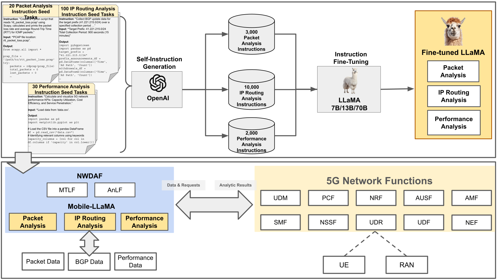
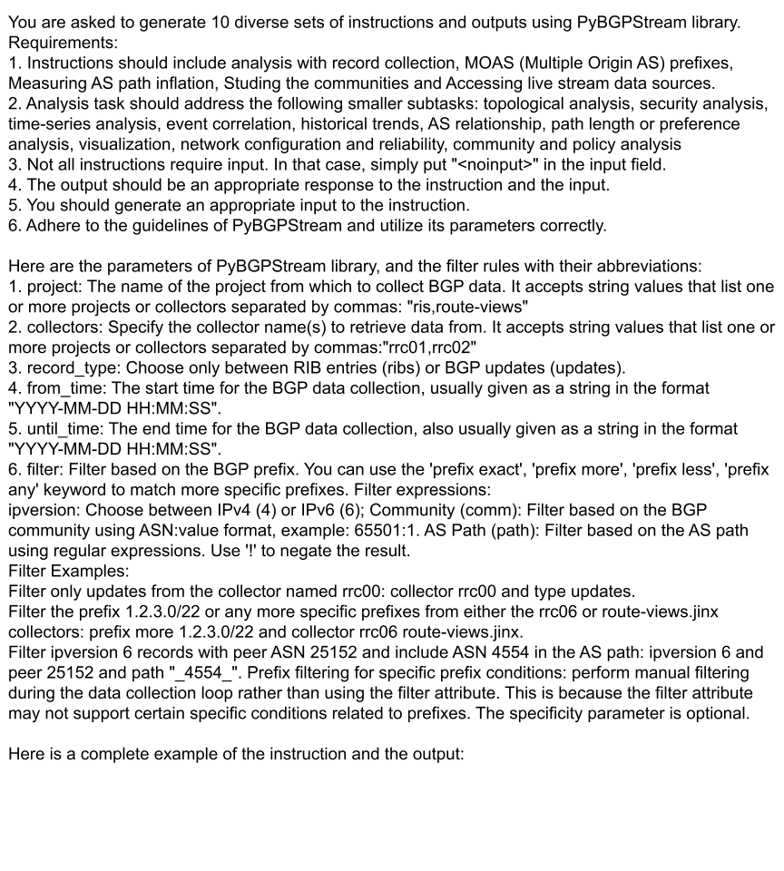
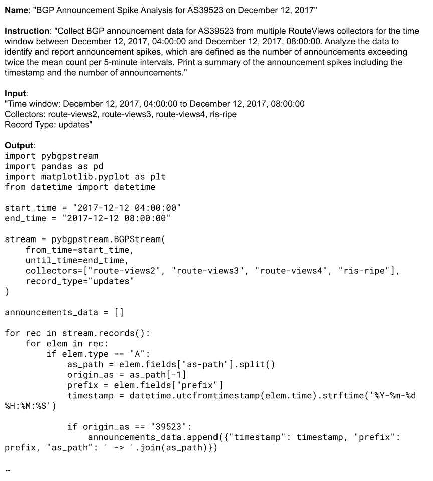
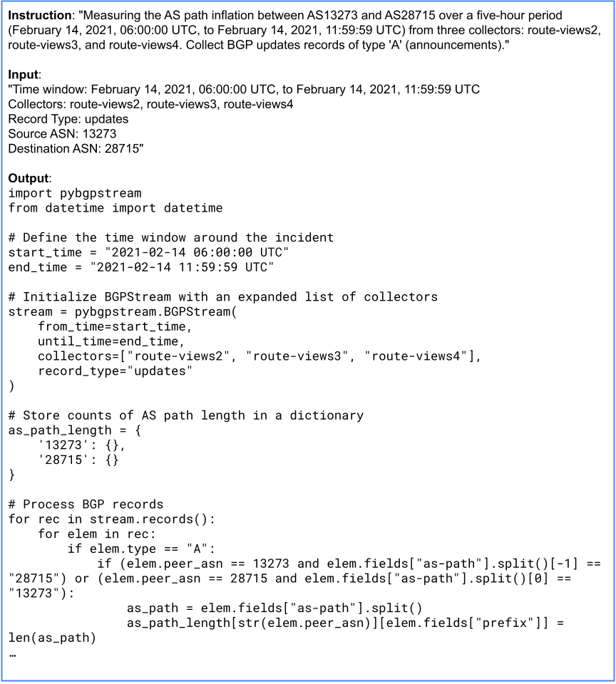
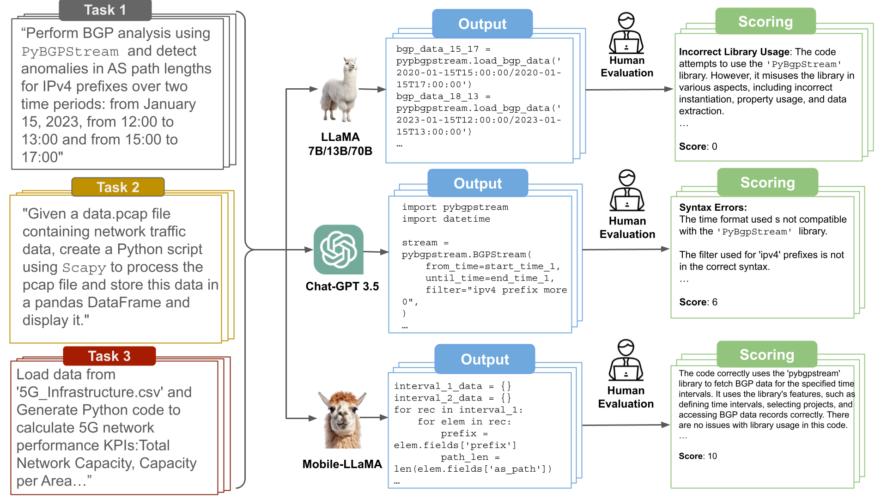
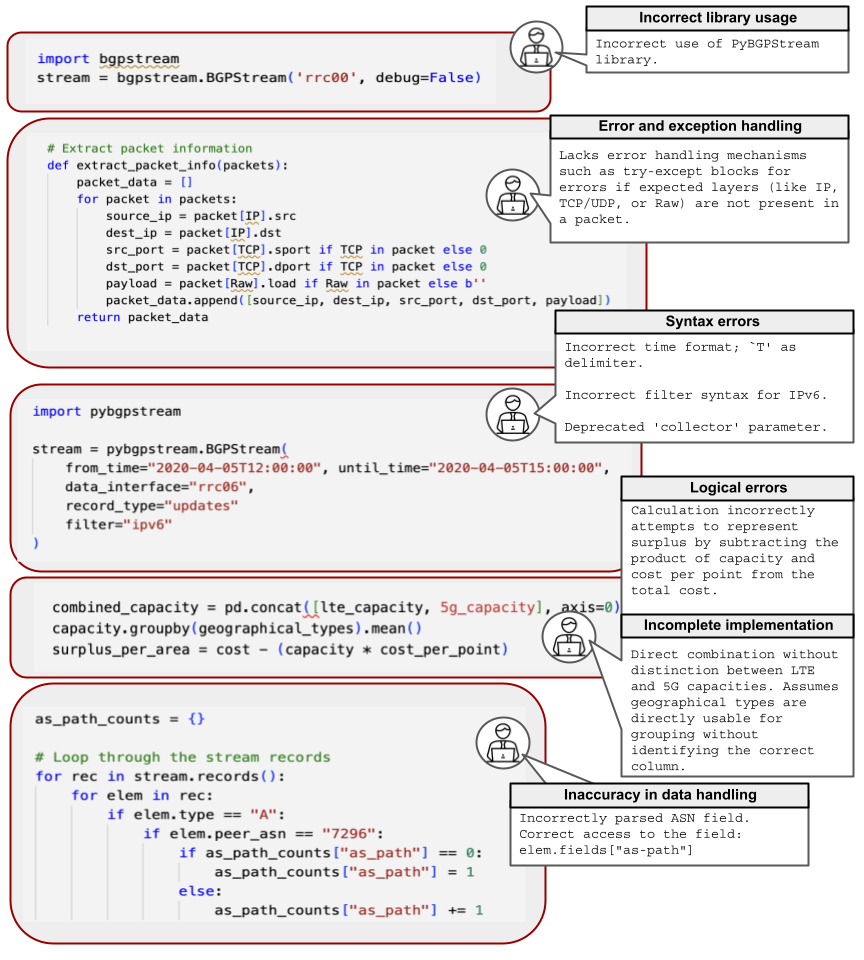

# Mobile-LLaMA: Instruction Fine-Tuning Open-Source LLM for Network Analysis in 5G Networks

**Abstract**: In the evolving landscape of 5G networks, Network Data Analytics Function (NWDAF) emerges as a key component, interacting with core network elements to enhance data collection, model training, and analytical outcomes.
Language Models (LLMs), with their state-of-the-art capabilities in natural language processing, have been successful in numerous fields. In particular, LLMs enhanced through instruction fine-tuning have demonstrated their effectiveness by employing sets of instructions to precisely tailor the model's responses and behavior. However, it requires collecting a large pool of high-quality training data regarding the precise domain knowledge and the corresponding programming codes.
In this paper, we present an open-source mobile network-specialized LLM, Mobile-LLaMA, which is an instruction-finetuned variant of the LLaMA-13B model. We built Mobile-LLaMA by instruction fine-tuning LLaMA with our own network analysis data collected from publicly available, real-world 5G network datasets, and expanded its capabilities through a self-instruct framework utilizing OpenAI's pretrained models (PMs). Mobile-LLaMA has three main functions: packet analysis, IP routing analysis, and performance analysis, enabling it to provide network analysis and contribute to the automation and artificial intelligence (AI) required for 5G network management and data analysis.
Our evaluation demonstrates Mobile-LLaMA's proficiency in network analysis code generation, achieving a score of 247 out of 300, surpassing GPT-3.5’s score of 209.

## Directory Structure

- **self_instruct_data**: Three separate subdirectories, each containing instructions generated via the self-instruct framework for one of Mobile-LLaMA's main functions: Packet Analysis, IP Routing Analysis, and Performance Analysis.

- **training_data**: The main training data for Mobile-LLaMA. We've combined all the instructions used in training, totaling 15,111 instruction sets.

- **evaluation**: Three JSON files containing specific instructions used for "Performance Evaluation" in each respective function.

- **finetuning**: Python and Jupyter Notebook scripts designed for instruction fine-tuning of LLaMA 13B.

## Jupyter Notebook Scripts

- **Mobile-LLaMA_demo.ipynb**: Jupyter Notebook script allows you to load Mobile-LLaMA from HuggingFace and use it for demonstration and evaluation purposes. You can use this script to generate and evaluate code for various network analysis tasks.

## Getting Started
### Install
Clone this repository and navigate to the folder.
```bash
git clone github.com/DNLab2024/Mobile-LLaMA.git
cd Mobile-LLaMA
```
Install Package (python>=3.9)
```bash
pip install -r requirements.txt
```

## Figures and Tables
### The Architecture of NWDAF featuring Mobile-LLaMA for 5G network analytics
<figure>
  

</figure>

<div style="display: flex; flex-direction: row; justify-content: center; overflow-x: auto;">
    <div style="flex: 0 0 auto; margin-right: 10px;"> 
        <p align="center">Prompt example for IP routing function (PyBGPStream)</p>
        <p align="center">
            
        </p>
    </div>
    <div style="flex: 0 0 auto; margin-right: 10px;">
        <p align="center">Manual seed task example for IP routing function (PyBGPStream)</p>
        <p align="center">
            
        </p>
    </div>
    <div style="flex: 0 0 auto; margin-left: 10px;">
        <p align="center">Self-instruct generated example for IP routing function (PyBGPStream)</p>
        <p align="center">
            
        </p>
    </div>
</div>


### Analysis Tasks in NWDAF of 5G Network with Mobile-LLaMA and Training Data Summary
| Function of Mobile-LLaMA     | Analysis Tasks                                      | Library           | Manual Instruction Tasks | Self-Instruct Generated Instructions |
|--------------------------|-----------------------------------------|-------------------|------------------------|-------------------------------------|
| Packet analysis          | Parsing IP packets<br>Data structuring<br>RTT calculation<br>Packet size examination<br>Performance assessment<br>QoS assessment | `Scapy`           | 20                     | 2000                                |
| IP routing analysis      | BGP route anomalies<br>BGP path changes       | `PyBGPStream`     | 100                    | 10000                               |
| Performance analysis     | Per-user capacity Enhancement<br>5G investment cost analysis<br>Network quality evaluation<br>UE traffic anomaly detection<br>jitter & CQI benchmarking | `Pandas`, `Matplotlib` | 30 | 3000                                |


### Overview of Performance Evaluation Analysis Tasks

### Evaluation workflow
<div style="display: flex; flex-direction: row; justify-content: center;">
    <div style="flex: 1; margin-right: 10px;">
        <p align="center">Performance evaluation workflow</p>
        <p align="center">
            
        </p>
    </div>
    <div style="flex: 1; margin-left: 10px;">
        <p align="center">Error type examples</p>
        <p align="center">
            
        </p>
    </div>
</div>


